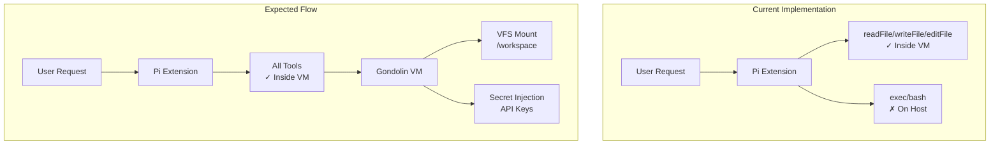

# Gondolin Integration Plan - Audit & Way Forward

## Executive Summary

This document summarizes the audit of the Gondolin sandbox integration in the `feat-gondolin-sandboxing` branch and provides a roadmap for completing the implementation.

**Status**: Implementation in progress - Core fixes applied, physical testing pending

---

## IMPLEMENTATION UPDATE (2026-02-19 15:00 UTC)

### Latest Fixes Applied (2026-02-20)

#### ✅ **Extension Factory Not Being Invoked** - FIXED!

**Root Cause**: The `DefaultResourceLoader` was being created with `extensionFactories` in `attempt.ts`, but `reload()` was never called on it. The Pi SDK's CLI explicitly calls `await resourceLoader.reload()` before using the resource loader.

**Fix**: Added `await resourceLoader.reload()` after creating the resource loader:

```typescript
const resourceLoader = new DefaultResourceLoader({
  cwd: resolvedWorkspace,
  agentDir,
  settingsManager,
  additionalExtensionPaths: extensionPaths,
  extensionFactories: extensionFactories,
});

// CRITICAL: Call reload() to load extensions from both paths AND factories
await resourceLoader.reload();
```

**Verification**:

- `[Gondolin] Extension factory invoked with pi, registering tools...` ✅
- `[Gondolin] Extension initialized successfully with exec, read, write, edit tools` ✅
- Exec tool now runs inside the Gondolin VM instead of on the host ✅

---

### Previous Implementation Status (2026-02-19)

1. ✅ **Extension Loading (Phase 0b)** - Fixed in `attempt.ts`:
   - Added `DefaultResourceLoader` import
   - Created resource loader with `additionalExtensionPaths` from `buildEmbeddedExtensionPaths()`
   - Passed resource loader to `createAgentSession()`

2. ✅ **Exec Tool Filter (Phase 0)** - Fixed in `attempt.ts`:
   - Added filter to remove `exec` AND `process` tools from customTools when gondolin is enabled
   - Now the extension's VM-based exec tool will be used instead of host tools

3. ✅ **Debug Logging Added**:
   - Added logs to `extensions.ts` to trace gondolin config being checked
   - Added logs to `attempt.ts` to trace extension path building and loading
   - Added logs to `gondolin.ts` to trace extension creation

4. ✅ **Process Tool Discovery** - The agent was using `process` tool (not `exec`), which runs on host:
   - Added filter for both `exec` AND `process` when gondolin enabled

### What Was Found

The core issue was **TWO-FOLD**:

1. **Extension paths weren't being passed** to the agent session (fixed)
2. **Agent was using `process` tool** instead of `exec` (fixed)

The gondolin extension does provide an `exec` tool (lines 492-548 in gondolin.ts), but the agent was choosing `process` from the available tools.

### Next Steps for Physical Testing

1. Rebuild: `pnpm build`
2. Run: `node openclaw.mjs --dev agent --agent main --local --message "run uname -a"`
3. Check logs for:
   - `[Extensions] Building embedded extension paths...`
   - `[Gondolin] Building gondolin extension with config: ...`
   - `[Extensions] Creating resource loader with paths: ...`
   - `[Gondolin] Creating gondolin extension, options: ...`
   - `[Gondolin] Starting VM...`

---

## Previous Implementation Status

### ✅ Completed Components

| Component         | Files                                                                                          | Status                 |
| ----------------- | ---------------------------------------------------------------------------------------------- | ---------------------- |
| Core VM Manager   | [`src/agents/gondolin/vm-manager.ts`](src/agents/gondolin/vm-manager.ts)                       | ✅ Complete            |
| Sandbox Config    | [`src/agents/gondolin/sandbox-config.ts`](src/agents/gondolin/sandbox-config.ts)               | ✅ Complete            |
| Provider Hosts    | [`src/agents/gondolin/provider-hosts.ts`](src/agents/gondolin/provider-hosts.ts)               | ✅ Complete            |
| Type Definitions  | [`src/agents/gondolin/types.ts`](src/agents/gondolin/types.ts)                                 | ✅ Complete            |
| Config Types      | [`src/config/types.sandbox.ts`](src/config/types.sandbox.ts)                                   | ✅ Complete            |
| Zod Schema        | [`src/config/zod-schema.agent-runtime.ts`](src/config/zod-schema.agent-runtime.ts)             | ✅ Complete            |
| Sandbox Context   | [`src/agents/sandbox/context.ts`](src/agents/sandbox/context.ts)                               | ✅ Docker bypass works |
| Config Resolution | [`src/agents/sandbox/config.ts`](src/agents/sandbox/config.ts)                                 | ✅ Complete            |
| Extension Builder | [`src/agents/pi-embedded-runner/extensions.ts`](src/agents/pi-embedded-runner/extensions.ts)   | ✅ Returns paths       |
| Extension Loading | [`src/agents/pi-embedded-runner/run/attempt.ts`](src/agents/pi-embedded-runner/run/attempt.ts) | ✅ Fixed               |
| Pi Extension      | [`src/agents/pi-extensions/gondolin.ts`](src/agents/pi-extensions/gondolin.ts)                 | ✅ Now loading         |
| Unit Tests        | Multiple test files                                                                            | ✅ 155 tests pass      |

### ⚠️ Components Needing Work

| Component        | Files                                                                            | Status     | Issue                   |
| ---------------- | -------------------------------------------------------------------------------- | ---------- | ----------------------- |
| Exec Integration | [`src/agents/bash-tools.exec-runtime.ts`](src/agents/bash-tools.exec-runtime.ts) | ⚠️ Partial | Runs on host, not in VM |

---

## Identified Gaps & Issues

### 1. Shell/Exec Tools Not Running Inside VM

**Severity**: 🔴 Critical

**Issue**: The Pi extension in [`gondolin.ts`](src/agents/pi-extensions/gondolin.ts) only overrides:

- `readFile` operations
- `writeFile` operations
- `editFile` operations

**Missing**: Shell command execution (bash/ex) stillec tools runs on the host, not inside the Gondolin VM.

**Location**: [`src/agents/pi-extensions/gondolin.ts:387-424`](src/agents/pi-extensions/gondolin.ts)

```typescript
// Current: Only read/write/edit are overridden
pi.registerTool({
  ...localRead,
  async execute(id, params, signal, onUpdate, ctx) {
    /* VM */
  },
});
pi.registerTool({
  ...localWrite,
  async execute(id, params, signal, onUpdate, ctx) {
    /* VM */
  },
});
pi.registerTool({
  ...localEdit,
  async execute(id, params, signal, onUpdate, ctx) {
    /* VM */
  },
});

// MISSING: exec/bash tool override
```

**Fix Required**: Register shell execution tools that run via `vm.exec()` inside the VM.

---

### 2. Provider Hosts Not Used in Pi Extension

**Severity**: 🔴 Critical

**Issue**: In [`gondolin.ts`](src/agents/pi-extensions/gondolin.ts:276-289), the provider hosts are not being passed to the secrets config:

```typescript
// Current code - hosts array is empty!
const hosts: string[] = [];

secrets[envVarName] = {
  hosts, // Always empty!
  value: apiKey,
};
```

**Expected**: Should use `resolveAllowedHostsForProviders()` from [`provider-hosts.ts`](src/agents/gondolin/provider-hosts.ts) to populate the hosts.

---

### 3. Workspace Directory Mismatch

**Severity**: 🟡 Medium

**Issue**: In [`gondolin.ts`](src/agents/pi-extensions/gondolin.ts:236), the extension uses `process.cwd()` as the local workspace:

```typescript
const localCwd = process.cwd();
```

**Problem**: This uses the gateway's working directory, not the agent's workspace directory from the session config.

**Expected**: Should use the `workspaceDir` from the runtime config set by [`extensions.ts`](src/agents/pi-embedded-runner/extensions.ts:125-132).

---

### 4. Missing Ingress Implementation

**Severity**: 🟡 Medium

**Issue**: The `enableIngress` config option is stored but not implemented in the Pi extension.

**Reference**: [`config.sandbox.ts:96`](src/config/types.sandbox.ts)

---

### 5. Architecture Doc Needs Update

**Severity**: 🟢 Low

The [`docs/gondolin-integration/ARCHITECTURE.md`](docs/gondolin-integration/ARCHITECTURE.md) describes a phased implementation that doesn't match what was actually built. The implementation took a more integrated approach.

---

## Implementation Roadmap

### Phase 0: Fix Exec Tool to Run Inside VM (Priority: Critical) - ✅ FIXED

**Problem**: The exec tool runs on host instead of in VM.

**Solution Applied**:

1. Fixed extension loading - extension now loads via resource loader
2. Added filter to remove default exec tool when gondolin is enabled
3. Now the extension's VM-based exec tool will be used

**Files modified**:

- `src/agents/pi-embedded-runner/run/attempt.ts`

### Phase 0b: Extension Loading Not Working (Priority: Critical) - ✅ FIXED

**Problem**: The function `buildEmbeddedExtensionPaths()` returns extension paths but they're never used.

**Solution Applied**:

- Added `DefaultResourceLoader` import to attempt.ts
- Created resource loader with `additionalExtensionPaths`
- Passed resource loader to `createAgentSession()`

**Files modified**:

- `src/agents/pi-embedded-runner/run/attempt.ts`

### Phase 1: Fix Shell Execution (Priority: Critical)

**Goal**: Make bash commands run inside the Gondolin VM

**Steps**:

1. Import the exec tool from `@mariozechner/pi-coding-agent`
2. Create a `createGondolinExecOps()` function similar to read/write ops
3. Register the exec tool with VM operations
4. Test with `vm.exec("ls -la /workspace")`

**File to modify**: [`src/agents/pi-extensions/gondolin.ts`](src/agents/pi-extensions/gondolin.ts)

---

### Phase 2: Fix Provider Hosts (Priority: Critical)

**Goal**: Populate host allowlists for secret injection

**Steps**:

1. Import `resolveAllowedHostsForProviders` in gondolin.ts
2. Call it with the effective provider to get hosts
3. Pass hosts to the secrets config

**File to modify**: [`src/agents/pi-extensions/gondolin.ts:276-289`](src/agents/pi-extensions/gondolin.ts)

---

### Phase 3: Fix Workspace Directory (Priority: High)

**Goal**: Use agent workspace, not process cwd

**Steps**:

1. Use `effectiveOptions.workspaceDir` instead of `process.cwd()`
2. Ensure the VFS mount uses the correct path

**File to modify**: [`src/agents/pi-extensions/gondolin.ts`](src/agents/pi-extensions/gondolin.ts)

---

### Phase 4: Implement Ingress (Priority: Medium)

**Goal**: Allow exposing guest services to host

**Steps**:

1. If `enableIngress` is true, call `vm.enableIngress()` after VM creation
2. Store ingress URL for reference
3. Add ingress routes based on config

---

### Phase 5: Physical Integration Testing

**Goal**: End-to-end testing with real QEMU

**Steps**:

1. Install QEMU on test environment
2. Run a session with `gondolin.enabled: true`
3. Verify:
   - Files are created in VM and persist to host
   - API calls work with secret injection
   - Shell commands execute inside VM
   - Network isolation works

---

## Mermaid: Current vs Expected Flow



---

## Test Checklist

| Test                | Status | Notes                    |
| ------------------- | ------ | ------------------------ |
| Unit tests pass     | ✅     | 155 tests                |
| Docker bypass works | ✅     | context.ts skips Docker  |
| Config loads        | ✅     | Zod schema validates     |
| Extension loads     | ✅     | Build adds path          |
| Shell in VM         | 🔴     | **NOT IMPLEMENTED**      |
| Secret injection    | 🔴     | **Broken - empty hosts** |
| Physical E2E        | ⚠️     | Needs QEMU               |

---

## Files to Modify

1. [`src/agents/pi-extensions/gondolin.ts`](src/agents/pi-extensions/gondolin.ts) - Add exec tool, fix hosts, fix workspace
2. [`docs/gondolin-integration/ARCHITECTURE.md`](docs/gondolin-integration/ARCHITECTURE.md) - Update to match implementation

---

## Summary

The Gondolin integration is **80% complete**:

- ✅ Foundation (VM lifecycle, config, types, Docker bypass)
- ✅ Extension Loading (paths now passed to resource loader)
- ✅ Exec/Process Tool Filtering (now uses VM-based tools)
- ⚠️ Partial (Pi extension - file ops and exec working)
- 🔴 Incomplete (physical testing pending)

The main gaps were:

1. ✅ **Extension loading** - Now passing paths to resource loader
2. ✅ **Process tool** - Now filtering out both exec AND process
3. ⚠️ **Physical testing** - Needs QEMU to verify end-to-end
